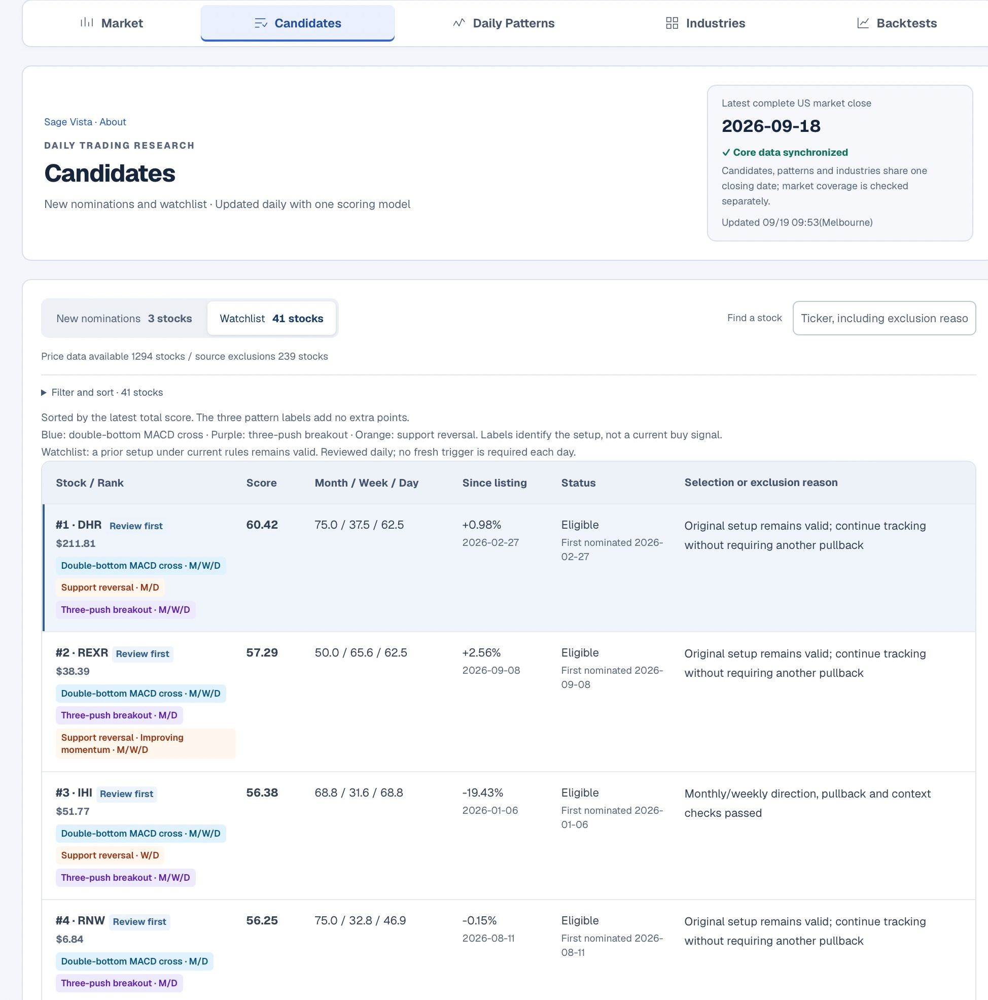
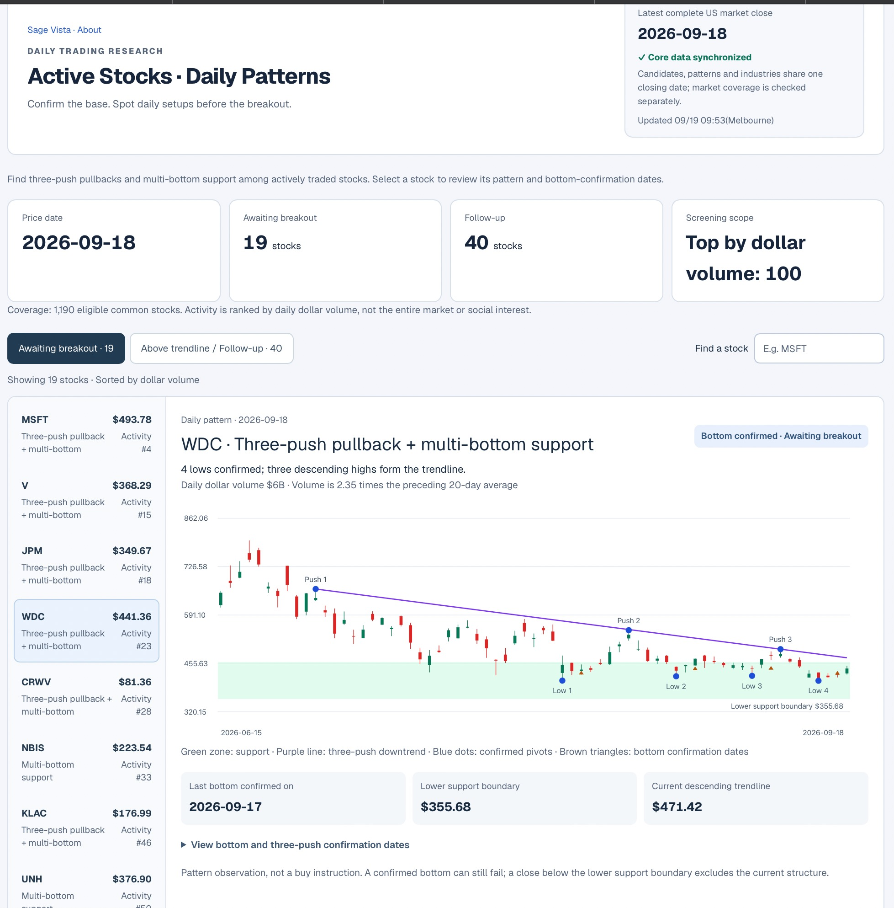
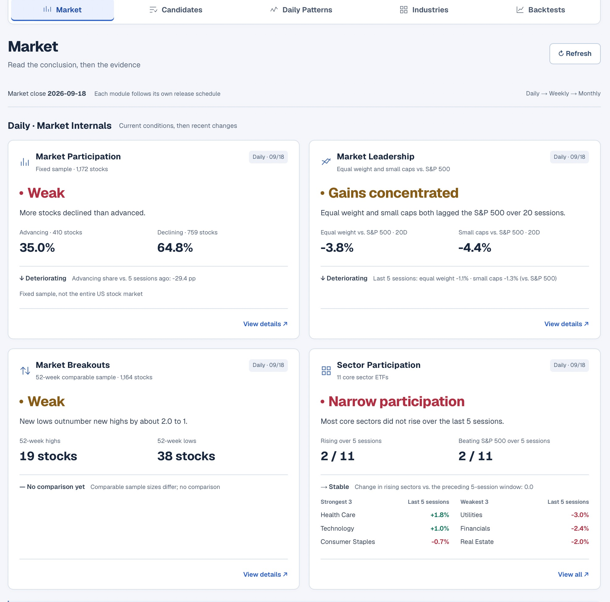
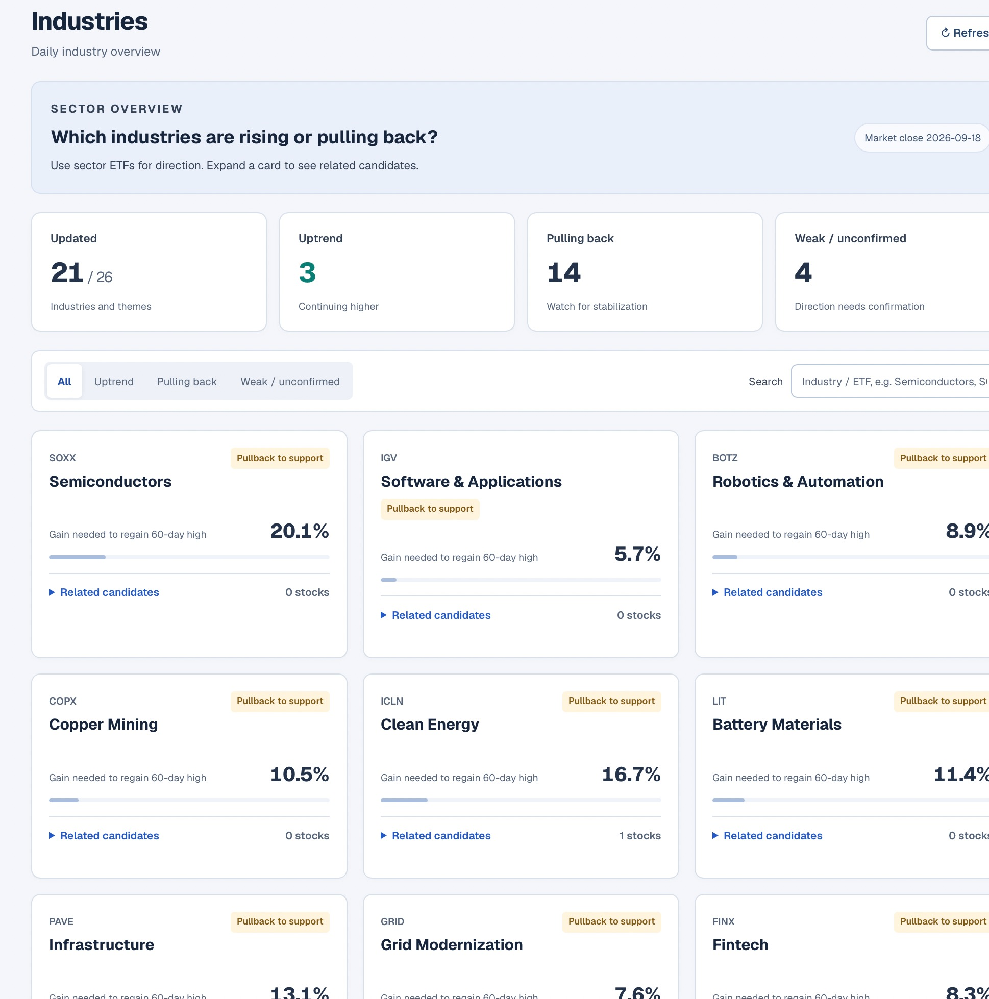
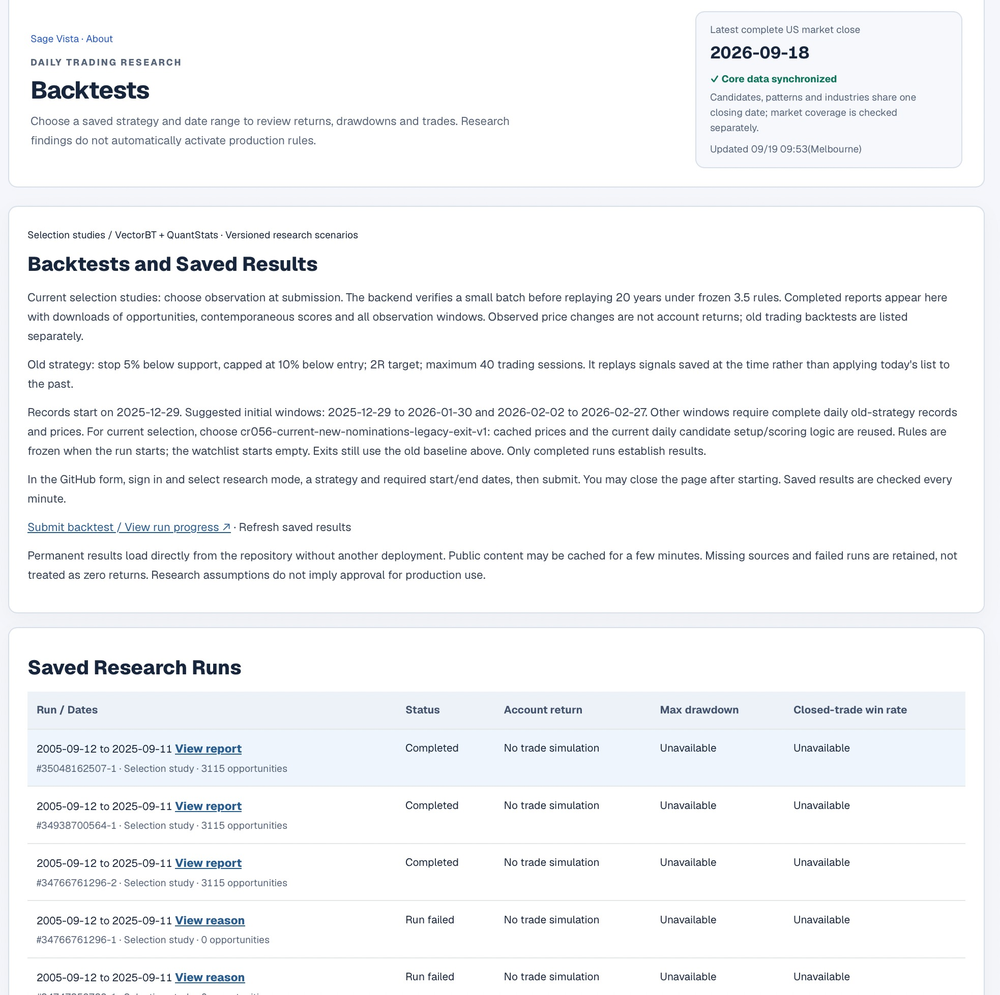

<div align="center">

# Sage Vista

### From market noise to explainable trade setups.

Sage Vista scans U.S. equities, surfaces setups worth investigating, explains the evidence behind them, and tracks what happens next.

**[🌐 Live Demo](https://sage-vista-parallel.gizmo-allied-0s.workers.dev/zh/watch/resonance/rare-opportunities) · [中文](./README.zh-CN.md) · [Documentation](./docs/SAGE_VISTA_RULEBOOK_ZH.md)**

Choose **English** in the top-right language switch.

</div>

<br>



**Find opportunities.** Start with a focused research list, then see the evidence behind each candidate.

<div align="center">

**Scan → Understand → Prioritise → Track → Learn**

</div>

<br>

## ✨ What Sage Vista does

- **Discover** — Find technical setups without manually scanning thousands of tickers.
- **Understand** — See price structure, timeframe alignment and supporting evidence.
- **Add context** — Read the market and sector conditions around a setup.
- **Learn** — Test ideas and track signals, keeping both successful and failed cases.

<br>

## 👀 See it in action

### Understand the setup



**Why is this stock here?** Inspect the pattern, support zone and confirmation dates behind the setup.

<br>

### Read the market



See whether market participation and leadership support the setup or call for caution.

<br>

### Follow the industries



Compare industry trends and pullbacks, then explore related candidates.

<br>

### Test and learn



Review saved studies, including failed runs and missing results, before drawing conclusions.

*Screenshots supplied by the project owner; the displayed market close is 18 September 2026.*

<br>

## What is Sage Vista looking for?

> **Is the larger trend still healthy?**<br>
> **Has the pullback reached meaningful support?**<br>
> **Is selling pressure fading?**<br>
> **Are buyers beginning to regain control?**<br>
> **Do other signals support the same story?**

No single indicator decides the trade. Scores summarise evidence; they are **not probabilities of profit or predictions of return**.

<br>

## ⚙️ How it works

**Market Data → Screening → Pattern & Factor Analysis → Market / Sector Context → Ranking → Tracking → Validation**

Sage Vista started as a stock picker. Its goal is to understand whether the setups it finds can become part of a repeatable trading process.

<br>

## 📊 Research behind the product

| Historical Events Audited | Registered Factors | Registered Experiments |
|---:|---:|---:|
| **62,000+** | **39** | **41** |

An archived 2026 baseline study contains **1,166 mature events** measured over a **20-trading-day window**.

<details>
<summary><strong>Research results, methodology & limitations</strong></summary>

**Archived 2026 baseline · 20-trading-day holding window**

**54.3% win rate · 1.51 profit factor · +2.10% average event return before costs**

Daily MACD cross events, entered at the next session's adjusted open; repeat events per stock are excluded within 120 trading days. The study ends on **28 August 2026**. Average event return falls to **+1.60%** with a 0.50% cost assumption.

These are historical event-study results, not live or paper portfolio returns or evidence that today's ranking predicts returns. Higher scores did not consistently produce better outcomes in this study; historical delisted-stock coverage is partial.

[Study & limitations](./research/preregistrations/score-timeframe-attribution-v2.md) · [Result data](./research/backtest/output/score-timeframe-attribution-v2.json). Factor count: [registry v0.10.0](./public/factor-registry.json); experiments: [13 September 2026 catalogue](./research/generated/experiment-catalog.json), including unfinished work.

</details>

<br>

## 🚀 Where it's going

The project is evolving toward a fuller trading workflow:

**Research → Decision → Trade Plan → Paper Execution → Risk Management → Performance Analysis**

Today, Sage Vista focuses on **research, testing and human decision support**. Live automated order execution is not part of the system.

<br>

## 🛠 Built with

`Python` · `TypeScript` · `React` · `Cloudflare`

Run the web app locally with **Node.js 22.13.0 or newer**:

```bash
npm install
npm run dev
```

Explore the [product & methodology](./docs/SAGE_VISTA_RULEBOOK_ZH.md), [architecture](./docs/SYSTEM_ARCHITECTURE_ZH.md), [research](./research/README.md) and [recorded project status](./docs/CURRENT_STATUS_ZH.md). The demo supports English and Chinese. Most detailed documentation and archived reports are in Chinese.

Contributor and agent workflow: [AGENTS.md](./AGENTS.md) · [governance](./docs/rules/01_GOVERNANCE.md).
