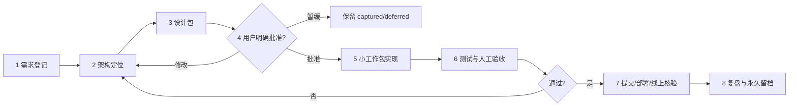

# Sage Vista 修改申请与交付流程

用途：把每次聊天中的修改申请变成可审查、可批准、可执行、可回退的工作单。没有完成本流程，不进入业务代码。

状态：已确认的治理流程正文。CR-2026-08-30-037提出的`requirements_closed`详细闸门仍为`design_review`，本文件暂不把该候选闸门写成已经生效。

总架构见 [`SYSTEM_ARCHITECTURE_ZH.md`](SYSTEM_ARCHITECTURE_ZH.md)。需求与最终证据保存在 [`CHANGE_REQUESTS_ZH.md`](CHANGE_REQUESTS_ZH.md)。

## 一、角色分工

| 角色 | 负责 | 不负责 |
| --- | --- | --- |
| 产品负责人（用户） | 定目标、判断是否实用、确认架构、批准实施和上线 | 不需要追踪代码调用关系 |
| 架构／研究负责人（Codex） | 还原当前链路、定位模块、提出最小接入方案、说明风险和取舍 | 未批准前不能擅自实施 |
| 实现负责人（Codex） | 严格按已批准设计包小步修改、注释、测试和报告差异 | 不能顺手加入设计包之外的功能 |
| 自动验证（测试／CI） | 检查数据契约、防前视、页面、部署和通知边界 | 不能代替用户判断产品是否好用 |
| 发布记录（Git／Cloudflare） | 保存提交、生产数据日、部署和线上核验证据 | 不能把本地草稿写成已上线 |

同一个Codex可以承担多个执行角色，但必须按阶段切换，不能一边设计一边擅自扩大实现。

## 二、八道门



### 1. 需求登记

- 原样保存用户要解决的问题，不先翻译成某个代码方案。
- 分清是新功能、规则变化、实验、修错、重构、UI、数据源还是运维。
- 写入`CHANGE_REQUESTS_ZH.md`，初始状态为`captured`。
- 同一段对话出现多个想法时拆成独立CR，不能捆成一个大改动。

### 2. 架构定位

必须先回答：

1. 当前数据从哪里来、经过哪些模块、最终到网站／Discord的哪一块？
2. 新需求属于共享入口、复杂多因子、个人形态、行业、大盘、风险执行、追踪、UI、Discord还是研究？
3. 谁是该输出的唯一生产者？是否已经存在可复用接口？
4. 是局部变化还是会改变候选集合、分数、收益口径或历史兼容性？
5. 哪些模块明确不应被影响？

只读检查可以在这一阶段进行；业务代码、生产JSON、评分和工作流不得修改。

### 3. 设计包

Codex先提交一份简短但完整的设计包，至少包含：

- 当前流程与问题；
- 目标流程图和插入位置；
- 输入、输出和版本；
- 修改文件范围与明确不改范围；
- 对每日扫描、回测、网站、Discord和历史账本的影响；
- 迁移／兼容方式；
- 测试、人工案例和验收标准；
- 回退方法；
- 拆分后的工作包，每包预计不超过20分钟；
- 只列真正需要用户决定的选项。

完成后状态改为`design_review`。这仍然不是实施许可。

### 4. 用户明确批准

只有用户在看过设计包后明确表达“按这个方案做”“批准实施”或“开始执行CR-编号”，状态才可改为`approved`。

下列内容不算实施批准：

- 只提出一个新想法；
- 只说“这个方向不错”；
- 只要求调查、解释、对比或举例；
- 只批准记录或实验设计；
- 先前对相似功能的批准。

用户修改边界后，设计包必须更新，再次确认；不能把旧批准套到新范围。

### 5. 小工作包实现

- 每次只处理一个CR中的一个可独立验证工作包。
- 单个工作包预计超过20分钟时，实施前继续拆小。
- 开始时说明：本包改哪里、不会改哪里、完成判据是什么。
- 只修改设计包列出的文件和接口；发现额外需求立即停止，新增或退回`design_review`。
- 不顺手重构、不顺手改文案、不顺手升级依赖、不顺手调整评分。

### 6. 测试与人工验收

验证分四层，按影响范围选择：

1. 单元测试：单个定义和边界是否正确。
2. 契约测试：输入输出、日期、版本、防前视和唯一生产者是否正确。
3. 集成测试：后台产物、网站和Discord是否使用同一事实。
4. 人工案例：至少给出代表成功、失败和边界案例，说明触发与未触发原因。

测试通过不代表自动上线；用户要求人工复核时，先交案例和差异。

### 7. 提交、部署与线上核验

- 提交前列出准确改动文件、数据迁移和未完成项。
- 只有用户已批准上线，才推送、部署或发送真实Discord。
- 上线后核对生产URL、构建版本、数据日、JSON日期、防前视和通知状态。
- 本地完成、测试完成、已提交、已部署是四个不同状态，必须分别说清楚。

### 8. 复盘与永久留档

- 把测试、案例、提交、部署和线上证据写回CR。
- 有实验时追加成功、失败、负结果、样本不足和中断事件。
- 记录实际改动是否超出估计、是否产生重复逻辑和下一步是否需要瘦身。
- 只有代码、测试、提交、部署和必要线上核验全部完成，状态才是`implemented`。

## 三、固定设计包模板

每次修改前复制下面模板；简单修改可以短写，但不能跳过字段。

```text
# CR-YYYY-MM-DD-NNN｜标题

## 1. 要解决的问题
- 用户目标：
- 成功后用户能做什么：
- 本次不解决什么：

## 2. 当前链路
- 数据输入：
- 当前模块：
- 当前输出：
- 网站消费者：
- Discord消费者：
- 当前问题：

## 3. 目标接入方式
- 架构层：
- 唯一负责人模块：
- 复用接口：
- 新增／改变的输入：
- 新增／改变的输出：
- 版本与历史兼容：

当前：A → B → C
目标：A → B → [本次变化] → C

## 4. 影响矩阵
- 数据与股票池：改 / 不改
- MACD门票：改 / 不改
- 因子定义：改 / 不改
- 多因子排名：改 / 不改
- 我最喜欢形态：改 / 不改
- 行业／大盘：改 / 不改
- 止损／退出：改 / 不改
- 历史账本：改 / 不改
- 网站：改 / 不改
- Discord：改 / 不改
- 回测／实验：需要 / 不需要

## 5. 文件边界
- 允许修改：
- 明确禁止修改：
- 旧路径如何兼容或退休：

## 6. 验收与回退
- 自动测试：
- 人工案例：
- 页面／Discord验收：
- 回退点：
- 失败时保持什么不变：

## 7. 工作包
1. 包A（≤20分钟）：
2. 包B（≤20分钟）：
3. 包C（≤20分钟）：

## 8. 等待用户决定
- 必须确认的选择：
- 状态：等待批准实施 / 要求修改 / 暂缓
```

## 四、三条执行通道

| 通道 | 适用 | 审批与验证 |
| --- | --- | --- |
| 标准变更 | 功能、扫描、评分、UI、Discord、数据合约 | 完整设计包；用户批准后实施 |
| 实验变更 | 因子、组合、止损、退出、权重挑战者 | 完整设计包 + 预登记；结果不能自动进生产 |
| 紧急修复 | 网站无法打开、数据泄漏、错误通知等生产故障 | 先只读定位并给最小修复卡；用户批准后修复。若先暂停生产可降低风险，必须明确报告并补齐记录 |

文档错字等完全不改变行为的维护可以缩短设计包，但仍要说明文件、范围和“不改变业务语义”。

## 五、范围蔓延处理

实施过程中出现以下任一情况，当前工作包立即停止：

- 需要修改设计包外的模块；
- 输出JSON字段或版本需要额外变化；
- 候选数量、排行、评分、止损、退出或通知对象发生未预期变化；
- 需要删除旧数据或重写历史；
- 预计时间从一个小包扩大为多个模块；
- 测试暴露的是另一个问题。

停止后只报告证据，更新设计包，等待新批准。不能用“顺便修一下”绕过评审。

## 六、完成定义

一次修改只有同时满足以下条件才算完成：

- 用户批准的范围全部实现；
- 未批准范围没有变化；
- 必要测试和人工案例通过；
- 规则、版本、CR和实验账本同步；
- Git提交可追溯；
- 如批准上线，网站和Discord已用同一数据日通过核验；
- 有明确回退点；
- 用户得到人话结论，而不是只有代码行数或统计数字。
