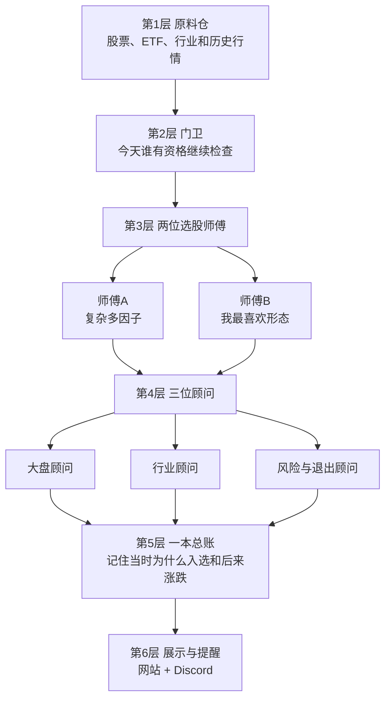
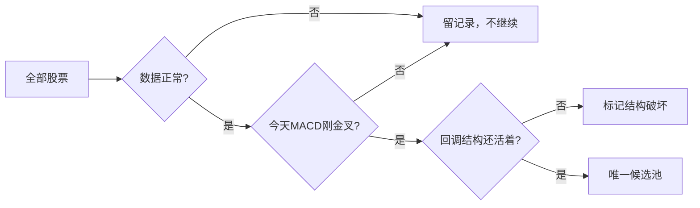
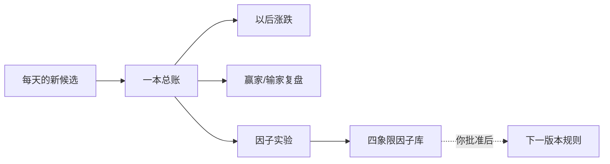
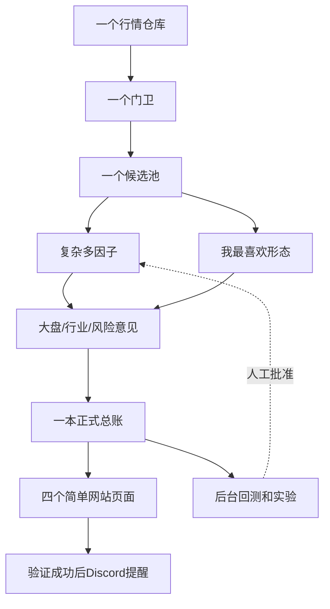

# Sage Vista 架构图：像小工厂一样理解

这份文档不用懂代码。只回答三个问题：

1. Sage Vista每天在做什么？
2. 现在为什么乱？
3. 应该怎样重新分层，才不会越改越乱？

当前线上基线是Git `b14ec55`，数据到`2026-08-28`。本地还有一批没有提交、没有上线的旧草稿；下面的“建议架构”也只是设计，不代表已经完成。

## 一句话说明

Sage Vista像一家选水果的小工厂：

> 把股票行情送进仓库 → 门卫先挑出今天值得检查的股票 → 两位师傅分别用两种方法检查 → 大盘、行业和风险顾问补充意见 → 记进一本账 → 网站展示 → Discord提醒。

## 最简单的六层



最重要的原则：**每层只做自己的事。**

- 仓库不打分。
- 门卫不研究39个因子。
- 两位选股师傅不各自重新扫描全市场。
- 大盘和行业不能偷偷改成技术因子。
- 网站不计算股票。
- Discord不创造另一套排行榜。
- 历史只记一次，不能有两本互相打架的账。

## 第1层：原料仓

这一层只负责“把材料准备好”。

里面放：

- 每只股票每天的开盘、最高、最低、收盘和成交量；
- SPY、QQQ、SOXX等大盘和行业ETF；
- 股票属于哪个行业；
- 哪只股票还在交易、哪只已经退市；
- 历史回测需要的旧行情。

它不能做的事：

- 不能说哪只股票好；
- 不能给因子加分；
- 不能决定买卖。

股票池也在这一层管理：

```text
日常扫描：核心热门股票 → 主扫描池 → 拓展池 → 更小股票

历史回测：核心池 → 主扫描池 → 拓展池 → 更小股票 → 退市／将退市股票
```

为什么历史要看退市股？因为只研究今天还活着的股票，就像只问考试及格的人“你以前怎么学习”，会把失败者全部漏掉。

## 第2层：门卫

门卫只做便宜、快速的检查，避免每只股票都做昂贵分析。

顺序很简单：

1. 今天的数据完整吗？
2. 股票能正常交易吗？
3. 流动性够不够？
4. 今天是不是刚发生日线MACD金叉？
5. 回调是不是已经深到结构明显坏掉？

通过后，门卫只发一张“候选票”。两位选股师傅都使用这同一张票。



这里的“回调结构还活着”只是一道门，不是得分。0.618、70%和重新站回的位置应该在你确认规则后再定死，不能由代码自己猜。

## 第3层：两位选股师傅

### 师傅A：复杂多因子

他负责回答：

> 这只股票今天一共出现了多少个真正的技术共振？

他会看：

- 命中了多少颗因子；
- 来自多少个不同家族；
- 同一个想法有没有第二次确认；
- 日线、周线、月线有没有一起确认；
- 哪些因子只是观察，哪些正在使用，哪些准备弃用。

这个页面必须保留你喜欢的“因子分家图／四象限”：

```text
正在使用｜候选观察｜暂停加权｜准备弃用
```

相同家族用相同颜色。这样你一眼能看出是“很多不同证据”，还是“同一种证据重复了很多遍”。

复杂多因子是主选股器，但它输出的是**人工复核优先级**，不是“胜率保证”。

### 师傅B：我最喜欢形态

他负责回答：

> 这只股票像不像我平常最喜欢做的结构？

他主要看：

- 长期上涨后出现回调；
- 双底或三底；
- 三推趋势线突破，或者突破后回踩；
- 回调落在Golden Pocket或EMA动态支撑；
- EMA20是否说明股票重新变强；
- 有没有明显空头压力需要否决。

他不需要和39因子比赛，也不需要制造一个复杂总分。最好输出“形态走到哪一步”：

```text
回调中 → 底部形成 → 等待突破 → 入场就绪 → 突破后跟踪
                         ↘ 风险否决
```

两位师傅可以对同一只股票给出不同意见，这是正常的；但他们必须从同一个候选池开始，不能各自重新扫几千只股票。

## 第4层：三位顾问

### 大盘顾问

看SPY、QQQ、IWM、市场广度和风险偏好，告诉你现在是进攻、分化还是防守。

### 行业顾问

看软件、半导体、机器人、AI、内存、行业ETF和成员强弱，告诉你这只股票有没有行业支持。

### 风险与退出顾问

告诉你：

- 支撑在哪里；
- 止损放在哪里；
- 目标和风险收益比是多少；
- 持仓后有没有触发退出条件。

这三位顾问只能补充意见，不能回头篡改“技术因子到底有没有命中”。

例如：

- 技术很好，但大盘很差：仍然显示技术很好，同时标记环境风险。
- 股票处在强行业回调：行业顾问可以说值得优先人工看，但不能凭空多造三颗技术因子。
- 入场后出现放量大阴线：风险顾问负责退出，不把原来的入场历史改成“从未入选”。

## 第5层：一本总账

系统应该只有一本正式机会账。

每个候选第一次出现时，记住：

- 哪只股票、哪一天；
- 为什么通过门卫；
- 两位师傅分别看到了什么；
- 当时的大盘、行业和风险情况；
- 下一交易日的参考入场；
- 后来1日、5日、20日、60日怎样；
- 最终怎么退出。

以后股票掉榜、亏损或实验失败，也不能删除。

回测和实验都从这本账拿数据，但实验只能写研究结论，不能自己改当天榜单。



## 第6层：网站与Discord

网站只是橱窗，不是厨房。

网站只保留四个入口：

1. 今日总览：今天更新了吗？先看什么？
2. 多因子机会：复杂多因子排行榜和因子分家图。
3. 我最喜欢形态：简单形态和所处阶段。
4. 行业与大盘：市场和行业背景。

多年明细、失败实验和大文件留在Git后台。网站只拿“今天”和“最近少量记录”，这样才快。

Discord也不计算，只做最后一步：

```text
网站已经发布并验证成功
→ Discord读取同一份今日精选
→ 检查以前有没有发过
→ 没发过才提醒
```

所以网站和Discord永远应该看到同一天、同一批股票、同一套理由。

## 现在为什么乱

现在像一家小工厂里同时存在这些问题：

| 现在的问题 | 像什么 | 后果 |
| --- | --- | --- |
| 多个程序重复扫描全市场 | 同一筐水果洗三四遍 | 慢、费钱、容易结果不同 |
| 旧Rare榜和新多因子榜并存 | 两位经理各发一张总排名 | 不知道谁是真的 |
| 旧Tracker还同时做扫描、榜单和形态 | 一个老员工什么都管 | 改一点会牵连很多地方 |
| Signal History和Opportunity Ledger两本账 | 两个会计记同一笔生意 | 数据重复、容易对不上 |
| 网站曾读取完整历史大文件 | 把整个仓库搬到橱窗里 | 页面重、部署慢 |
| Discord还读旧榜 | 店里卖新菜单，广播旧菜单 | 提醒和网站不一致 |
| 研究脚本、生产代码、旧兼容代码混放 | 实验室和厨房混在一起 | 不敢删，也不知道该改谁 |

你的判断是对的：当前架构有明显冗余。它不是完全不能用，而是“很多旧东西没有正式退休”。

## 建议优化后的样子



我的补充*在触发门票以后，我在想要不要按照家族和因子的效果来排序，做一个详细点的逻辑链条，然后我也可以人工主观的排序。

比如说，在我们37个因子里，门票过后，我们现在目前是不是满足支撑这个家族，家族里也按效果的顺序排，我随便举例，比如说有没有站在筹码峰，再到有没有踩到ema。之后是别的家族，家族里不同的因子。

时间上，先固定小周期带大周期，我们先做完日线，后找周线的因子，最后是月线的因子。逻辑是，小周期找启动证据，大周期找方向确认。然后我吗复杂多因子按照流程结束以后，我们移动到大盘/行业。

大盘和行业，本质上也就是找到对应的基金，看有没有回调，优先买已经回调+风险释放，回踩支撑位的，不优先买已经突破的。所以按理来说，还是可以拿对应的大盘或者行业基金来跑一次多因子（潜在可能）。

之后我们下一个环节是模拟买入（等同于风险意见）（我需要你加入一个额外板块，在正式总帐前，在大盘行业风险后），这个很重要，是我们后期回测的很重要，甚至是最重要环节。模拟买入有：什么时候买入（买入价和买入时机），止损点和止盈，还有持仓周期（我希望我们能控制持仓时间，假设我们买入后，过了很久没有突破，一直在横盘，那依旧是要退出的。比如我设想的，在‘我最喜欢形态’里，买入超过20 个交易日还没有有效盈利，那我就会退出。）

下一个板块是记录留档，比如触发的标的，时间，涉及的因子，模拟的交易的思路，模拟盈亏。

再下一个板块就是复盘，实验回测等等。这个可以优化所有的板块和流程，任意一个，或者任意复数个板块。

最后再是页面输出，再到discord输出。

和现在相比，只做六个收缩：

1. 多次扫描 → 一次准备行情、一个门卫。
2. 多个候选源 → 一个候选池。
3. 两个总排行榜 → 只保留复杂多因子为主榜；个人形态是独立观察页，不和主榜争权威。
4. 两本历史账 → 一本正式总账。
5. 网站读取大历史 → 网站只读小摘要。
6. Discord读旧逻辑 → Discord只读已经验证上线的网站结果。

## 应该怎样一步一步优化

不能一次大改。建议按下面顺序，每一步单独确认、单独测试：

### 第一步：先冻结

不再继续当前未提交草稿。把每一项标成：保留、重写、放弃。线上版本暂时不动。

### 第二步：先独立原料仓

把“读取当天行情、读取历史行情、股票池”从旧Tracker里拿出来，变成所有功能共用的唯一入口。先保证输出完全不变。

### 第三步：只留下一个门卫

全市场只判断一次MACD门票和回调结构。保存通过者，也保存被排除原因。

### 第四步：接回两位选股师傅

先接复杂多因子，确认榜单；再接“我最喜欢形态”。一次只迁一个，不同时改评分和页面。

### 第五步：合成一本账

选择Signal History或Opportunity Ledger中的一个做正式底账，把另一份迁移进去，确认记录没有丢失后再退休旧账。

### 第六步：瘦身网站和Discord

网站只拿今日小文件。Discord只在网站上线并核验后读取同一份结果。

### 第七步：最后才删除

旧代码没有任何页面、工作流、测试或研究需要后，才删除。Git保留恢复点。

## 以后提需求应该改哪一层

| 你提出的需求 | 应该放哪里 |
| --- | --- |
| 增加三底、FVG、EMA等技术因子 | 复杂多因子师傅 |
| 修改MACD门票或回调过深规则 | 门卫 |
| 调整“我最喜欢形态” | 个人形态师傅 |
| 增加AI、软件、机器人行业 | 行业顾问 |
| 大盘回调加分还是减分 | 大盘顾问及独立实验 |
| 移动止损、吞没退出 | 风险与退出顾问 |
| 改网页图表 | 网站橱窗 |
| 改Discord文案 | Discord广播员 |
| 找赢家、输家和有效组合 | 后台实验室 |

如果一个需求需要同时修改三层以上，就先停下来重新设计，不能直接写代码。

## 最后只记住这句话

> 一份行情、一个门卫、两个选股方法、三个独立顾问、一本总账、四个网页、一个Discord出口。

这就是建议中的Sage Vista。

