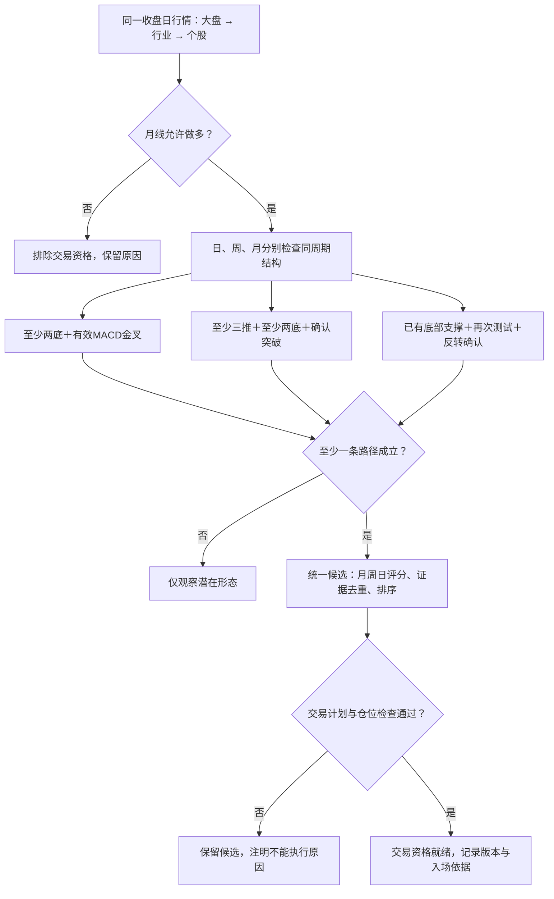
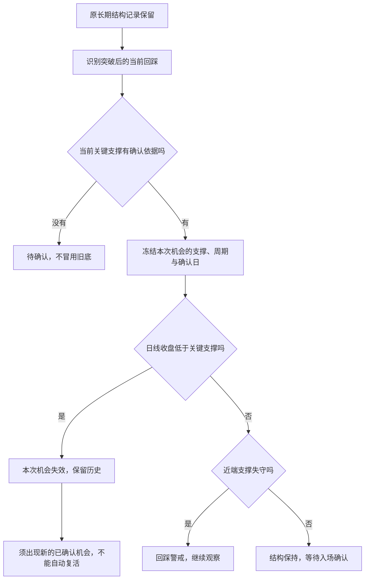

# 04｜评分机制规则

版本：`2.5.0`
最后更新：2026-09-12

## 金叉事件修正（2026-09-09，实施范围）

本轮仅修复多周期MACD事件：hit只表示该已完成K线实际金叉；latest_hit_date与bars_since_hit保存最近真实金叉日期与周期根数；recent_hit仅在原观察窗口内且当前仍在信号线上方时成立，重新死叉后不可沿用旧金叉。历史交叉事实与当前有效性分开，周/月日期仍按已完成周期末日标记，不冒充图表的周期起始标签。修正版本2.0.1只改变上述事件语义与来源版本，不实施三路径门票，不改权重；旧输出与回测保持原样。

## 底部反转三路径（2026-09-09，3.0.0已实现）

2026-09-09执行补充：用户要求每日更新与新回测共用本节准入入口，候选政策升级为3.0.0；政策指纹包含参数和门票/因子/评分实现内容，避免同版本修错后误用旧缓存；同一任务固定政策版本、内容指纹和代码，恢复时不混用新政策。旧报告只读，新回测默认当前政策；旧策略名不能悄悄执行新版。保留原月周许可、可交易性和3:2:1评分。

结构参数沿用现有技术配置：120根结构窗口、2根左右确认、底间隔5—60根、底价容差max(3%,1ATR)、中间反弹至少1ATR、收盘守住最低底。两底不再要求突破颈线；MACD金叉须在同一结构开始后且未失效，不以5根展示窗口代替结构有效性。支撑反转使用此前已确认底部，当前回测支撑并出现既有吞没/锤头/扩张阳线/十字后跟随；当前底无需借未来两根确认。趋势线突破沿用现有三推几何与实体收盘确认，必须首次收盘越线。以上容差为复用现有参数的候选实现，未宣称回测最优。

本节记录用户逐项确认的新交易逻辑；3.0.0实现共用入口，实际生产启用及新结果以需求账本证据为准。2.0.x历史快照、分数和回测结果保留。

- 月线优先且有做多否决权：高位/新高附近、偏离均线且动能衰减，或月线继续恶化时，不能靠日周线高分抵消；不必等周线一起转弱。允许有支撑/筑底依据且月线动能改善的低位修复，EMA空头排列本身不一票否决。
- 日、完整周、完整月分别识别结构；至少一个周期的完整组合成立，不跨周期拼凑底数和推数。其他周期支撑作为复合证据，不替代同周期结构要求。
- 三条候选准入路径：①同周期至少两底＋有效MACD金叉，不强制三推，零轴下金叉作为偏好证据；②同周期至少三推＋至少两底＋确认突破下降趋势线；③已有底部/支撑依据＋再次测试＋本次已确认反转信号，不必等金叉或趋势线突破。第三条不是仅凭预测潜在形态就买入。
- MACD再次死叉时旧金叉失效，MACD路径必须等新金叉；结构可以继续观察，第三条路径独立判断。实际交叉日期、距事件根数、有效窗口状态须分别保存，不能将最近5根内交叉误称当天交叉。AN、EG、SWKS旧案例的事件日期判断已撤回，准确日期须原行情重核。
- 统一月/周/日原多因子评分（月权重最高），门票不重复奖励；多条路径命中只保留一条候选并记录所有触发依据。统一交易计划、仓位及版本化账本，候选不等于买入。
- 收盘形态须收盘后确认，不能看完整K线却模拟买在当日最低点。实际执行时再检查支撑、止损、最近阻力、盈亏比及仓位；尚未冻结的数值不得随意补成已批准规则。
- 交付顺序：修正MACD事件口径并核对真实案例；实施同一候选入口的新准入规则；按最近可用已收盘交易日手动生成新版候选榜供用户检查，显示日期、政策版本、触发周期/路径、月周日分项及排除原因；再安排配对回测。后续用户明确要求每日更新与新回测同用当前规则；不包括做空策略激活。



### 持续观察重核与三类门票（2026-09-09，用户批准实施）

持续观察需具备“此前三路径门票至少一条已确认，且相应结构迄今未失效”的依据，取消仅靠旧提名免检。当前月周方向、背景、评分资格继续检查；不要求门票每天重新发生。原提名永久保留，新政策历史重核单独记录，不能把回溯识别说成当时真实发过警报。

- 沿现有观察账本保存门票类别、周期、完整结构身份、首次可知交易日、触发时收盘价、结构底部及失效日。旧池使用已有缓存从第420根可用日线起逐日重核；没有足够数据或没有找到有效新版结构的记录不列为合格持续观察，但保留可查询原因。已存同源检查点增量续跑，不反复扫描历史。
- 结构失效采用触发周期已完成K线收盘跌破当时结构最低底；支撑反转以原支撑与本次测试低点中的较低点为结构底。失效后不能因反弹自动复活旧记录，必须出现新门票。此边界是观察结构状态，不是已冻结的SL；MACD再次死叉会使新的金叉门票失效，但只要原结构未破坏，观察记录不因没有新金叉被抹掉。
- 蓝色“两底金叉”、紫色“三推突破”、橙色“支撑反转”，辅以文字和周期；多路径允许多个标签，不重复加分。标签表示历史门票来源，不保证现在就是买点。不同类别未来分别讨论买点/TP/SL，本轮不擅自设定交易参数。
- 2026-09-10纠正展示口径：主表“上榜后涨跌”从原候选榜提名日收盘计算，用当前同源复权行情取得当日基准价；缺少当日行情时显示不可用，不拿旧门票日期/价格替代。详情首先列上榜触发日期、上榜基准价、复评截止日，再分别列各类各周期门票的触发日、当前有效截至日或失效日。较早的回溯形态仅是历史研究记录，不冒充实际上榜或交易收益。原提名不可改写；历史来源修订保留旧快照。

### REXR／RGEN人工复盘（2026-09-09，反馈记录，未改规则）

- 用户最喜欢REXR：按用户图表解读，月线长期回落后在EMA100附近筑底，2026年7月接近看涨吞没、8月回踩；周线7月13日前后多推W结构突破后回踩EMA20支撑，关注回踩结束后的再次启动。回踩不应只理解为回踩原趋势线，也关注既有EMA等支撑。上述图形和日期为用户观察，未独立用原始K线核验；进行中周/月可能形成的吞没不得当作已确认事实。
- 用户对RGEN的判断：月线长期旗形/交易区间突破回踩有吸引力；周线6月1日前后已启动、日线目前死叉，因此长期方向与当前入场时机须分开，可能等待更深支撑/FVG回踩。此处记录用户研究假设，不构成买入建议、已验证旗形检测器或自动调参授权。
- 需要继续检验的差异：分高不等于机会更合适；用户重视底部位置、突破—支撑回踩—再启动的阶段及多周期配合。3.0.0原加权证据分尚不能充分表达这些质量差异。REXR/RGEN仅作为发现和规则讨论案例，不硬加分、不用于独立收益验证。
- 核对9月8日已发布结果：4只新提名＋37只持续观察均已复评。REXR46.875（月50／周37.5／日56.25），RGEN40.625（月50／周28.125／日37.5），两票原提名9月8日已写入观察账本。当日两个标签互斥展示；下一有效交易日成功复评后，仍合格者显示在持续观察，不合格者保留记录及原因。标签不会改变分数；旧观察池不要求重新取得新门票，因而“已按当前评分复评”不等于“今天触发三路径之一”。

### REXR／AMD／LNN／AMT补充复盘（2026-09-10，讨论记录，未激活规则）

- 用户判断REXR仍属回踩：36.5为前低警戒，进一步跌破35.7才视作结构破坏；价格为案例观察，不能写成全股票固定阈值。用户后续确认日线收盘低于35.7才失效，盘中刺破后收回不算；用户已同意推广：按机会所属结构确定关键底部，日线收盘确认失效；用户进一步确认：突破后以已确认的当前回踩支撑管理本次机会，不再等待跌破最初筑底最低点；长期底部状态与当前机会失效分别保存。9/9扫描收盘37.07，门票账本仍active，但独立local_structure回撤检查返回structure_broken并排除；其依据是局部上行波段回撤超过70%且收盘未收复0.618，不等于跌破门票结构底。后续应统一结构对象和状态语义，区分局部回撤风险与候选形态失效。
- AMD为用户提出的月线动能延续、日线执行案例，不手动加入候选。用户设想等回调机会，SL参考437下方、TP参考前高/新高附近，均为待核验实验设想。9/9实际扫描已通过日线bottom_macd（交叉9/4，检测底440.5），被monthly_not_confirmed、weekly_not_confirmed、monthly_high_zone排除。系统周/月使用9/4与8/31已完成K线，须对齐用户图表观察时间后核对；不得为此案例直接取消既有高位保护。
- LNN、AMT为用户认定的月线主导机会。LNN设想回踩EMA20与117.42支撑区，再等金叉；SL/TP参考月线结构，TP1 131、TP2 142，期待小周期带动月线突破。EMA20及金叉所属周期在执行实验冻结前须明确，不能擅自补成已批准参数。AMT未给具体执行价位。
- 改进方向（待讨论）：分别保存机会主导周期、入场择时周期、结构失效依据及交易SL/TP依据；主导周期不由哪一周期得分最高直接替代。沿用同一候选、观察和回测链路，不创建独立评分入口。以上案例用于解释与规则设计，未经独立验证不得称作有效收益结论。

### COKE人工复盘：日线机会与多周期质量（2026-09-10，案例反馈）

- 用户图示12日吞没启动、21日回踩趋势线为此前日线入场窗口（图中位置为8月，具体交易日期待核验）；周/月没有警报，只能按日线机会理解，当前案例质量/评分低，不纳入。
- 无周/月警报不自动等同于周/月方向恶化；日线局部反转也不能冒充月周共振或长期底部修复。历史买点与当前再次触发分开。
- 用户未给新的通用最低分或“日线机会一律排除”规则，不据此新增硬门槛。代码当前COKE因方向/结构许可排除、总分null；人工低质量结论与代码排除原因分别保留，不伪称一致机制。

### SSB人工复盘：结构有效不等于当前机会有效（2026-09-10，待接入）

- 第一轮固定9/9案例：用户认可3/20、5/15周线底与6/12周线金叉当时有效，6/12之后稍晚为很好的入场时机；目前已创新高、到达TP区，不应继续当作当前可参与机会。
- 当前机会除“结构失效”外还需“目标已到达/本轮完成”状态。原信号与后续表现保留，不能事后改成最初误选；新的回踩须重新确认，不能因旧金叉仍有效无限续用入场机会。
- 精确TP价格、首次可知日及实际到达日尚未核对。此处为人工阶段标签，不声称原策略当时已经预设/执行TP，不依据事后高点倒填历史目标。不得把“创新高”独立推广为所有类型统一退出规则。

### 突破回踩动能门票补充（2026-09-10，用户已确认，实施中）

- 仅用于突破成立、回踩获得支撑、当前机会结构仍有效的路径：三根已收盘日线MACD柱均为负，且连续两次严格趋近零（h[-3] < h[-2] < h[-1] < 0），可以承担动能确认，不强制已金叉或看涨吞没/后续阳线。平柱不算改善，不把“可能金叉”说成必然发生。
- 用户批准首版大阴线实验口径：收盘低于开盘、实体至少为前一日ATR14的1倍、上下影线各不超过全K线振幅10%；三根动能确认K线中任一命中即阻止本次新动能门票，不直接宣称原结构失效。ATR沿既有EMA平滑实现；零振幅/不足数据不冒充可验证。
- 实施首版复用既有回踩窗口1—5根已收盘日K、0.25ATR接近度、EMA20与既有三推突破几何。原突破当时必须已有两底；回踩允许在延伸趋势线或EMA20附近，收盘站回对应支撑与突破线，期间收盘不跌破原突破底部。先只实现日线突破后的这一确认分支，不声称已完成周/月主导当前支撑替换。
- 归入原第三类support_reversal，另存confirmation_kinds区分candle_reversal与negative_histogram_pullback；两者同时触发保留两个确认标签但只算一条该类门票。新动能条件不增加评分颗数，不取消既有月周/高位/局部风险许可。日更、历史预筛与报告共用同一事实及门票入口。
- 候选政策升级3.2.0，新旧指纹及结果隔离。上述是可复核的首版研究参数，不是已证明最优；大周期当前回踩支撑、SSB目标完成状态仍为后续步骤，不能以此声称整轮改造完成。
- 五轮验证与交付顺序唯一维护在[回测规则08](08_BACKTEST_AND_EXPERIMENTS.md#五轮策略实验计划2026-09-10用户批准规划)，不在这里复制实验流程。

### 当前回踩机会与长期结构（2026-09-10，用户批准，接线中）

- 长期筑底结构、当前回踩机会、交易止损是三个不同对象。原门票记录不改写；当前回踩机会必须记录自己的支撑依据、所属周期、首次可知日期和失效日期。
- 突破后出现新的已确认回踩支撑时，为该次机会建立关联记录。只有新的回踩依据确认后才能提高关键支撑，不随每日最低价下移，也不以更老、更低的长期底部延长已经失效的机会。
- 日线收盘低于该次机会的关键支撑即失效；等于支撑或盘中刺破后收回不触发该条失效。近端支撑失守只警戒。失效后反弹不能自动复活原机会，须确认新机会。
- 代码无法确定当前回踩支撑时显示待确认，不把最初筑底低点冒充当前支撑；这不等于长期方向被否定，也不擅自制造交易SL。
- 局部波段0.618/70%回撤是风险事实，不应再用同一名称宣称当前回踩关键支撑已经跌破。生产准入替换必须与当前机会支撑识别一起核验，不先简单删除所有风险限制。
- 沿同一事实→资格→评分→观察→回测链路实施。当前权重月/周/日3:2:1不变，REXR/AMD/LNN/AMT仅为已见案例，不硬编码价格、加分或强制入榜。



## 全因子多周期映射（2026-09-08，用户批准实施）

此前已确认并用于旧结果的固定政策为`cr056-policy-2.0.0-candidate`，内容指纹`sha256:d2b2bc0ca7da5c3fcde3266ecfbb0d61deea3ace2ff5169761e86a20a45b2f6c`。固定规则与权重，不冻结随行情变化的每日名次。AZO等人工正例只用于说明、诊断和提出实验假设，不提供入榜或加分特权；日线门票与所有资格照常检查。任何改变当前排名口径的调整先获用户确认、另记版本，不能在后续任务中自行漂移。

- 新候选政策2.0.0取代1.x的局部白名单；原快照和旧研究状态不回写。日线金叉取得首次门票，持续池无需再次金叉；原月周方向/高位/结构资格保留。本次不顺带改长期背景定义。
- 同一检测器接受日、完整周、完整月K线，窗口统一解释为该周期根数，禁止对月K再套周月聚合。保留39项原登记来源；周期别名合并，同一算法每周期只有一个身份。尚无客观定义的项目显示未实现，不伪造命中，也不进入分母。
- 可计算非风险技术因子均进入候选证据分，原rejected/testing等研究标签原样保存；用户授权的是人工复核候选分，不是宣布旧失败因子已验证。资格与日线金叉事件不重复加分，MACD方向质量按周期单列；风险独立展示。父子、同义证据去重；跨期不重复套用周期别名。
- 各周期使用相同可计分模板、同组/家族封顶与固定满分，再按月/周/日3:2:1加权。缺历史明确不可用，不缩分母。EMA仅使用已具备对应根数的均线；250根筹码估计不足时不可用，不伪称不存在。所有近期命中年龄以该周期根数计算。
- 网站沿用现有榜单，显示三个周期分数、命中/近期/未命中/缺数据/未实现/门票/风险；失格股票也可查证据。同日政策升级保存旧公开快照和旧观察检查点，以新政策独立复评，不改变原提名，不增加一次交易日连续警报计数、不重发当日警报。
- 本轮为用户主观政策改动和真实行情复评，不报告收益改善。后续配对实验以1.1.0为基线、2.0.0全因子映射为唯一组合变动，固定行情/门票/执行/成本，保存排除与失败；AZO仅作为发现案例。

## CR056获批候选榜边界

历史评分规则2.1.0对应候选政策 `cr056-policy-1.1.0-candidate`，先许可，再以固定白名单和周期满分归一后按月/周/日3:2:1加权；日满分5、周2、月3.25。唯一参数及内容指纹见services/contracts/cr056_policy.py，唯一评分见services/ranking/cr056.py。缺失不缩减分母；覆盖不足80%不可评分，不完整覆盖不发高分警报。参数尚未验证收益；旧1.x结果留档。 用户已授权真实重排及现有页面更新；已发布9月4日快照并沿既有日终流程接通自动复评；页面必须如实显示独立日期、落后和失败提示，接通不等于已取得跨交易日运行证据。原批准/预登记见提交acfc061，交付证据集中见[CR056](../CHANGE_REQUESTS_ZH.md)。后续核对首个跨交易日续跑，再大盘行业、回测。

### 月线首次缩柱修订（2026-09-08，用户批准）

- 月线负MACD柱只需最新完整月相比前一个完整月首次缩短：`previous < current < 0`。不再要求连续两次改善；进行中的月柱不混作已完成确认。周线仍保留连续两次负柱改善。
- 日线当日金叉门票、月线正柱衰减排除、月线/价格高位排除、其他资格与3:2:1权重不变；首次缩柱不等于自动入选或买入。
- 原政策1.0.0及其9/4结果冻结，新结果使用1.1.0及新内容指纹。既有日终任务在下一个有效交易日生成新结果；同日期旧结果不能仅换版本标签冒充重算。
- 当前实际计分：月线为MACD方向、EMA支撑、单/双看涨吞没；周线为MACD柱改善、EMA支撑。量能与bullish FVG目前仅日线接入。用户要求月周线复用这些证据，属于待补接线，不能声称月线权重高就已完整覆盖。
- 长期上涨背景应按月线理解；当前日EMA200代理不等价，仍是待修正的资格缺口。不得为AZO单例绕过，也不得未经明确规则将代理机械替换成任意月均线。
- 后续配对实验仅比较月线一次/两次缩柱，其余输入、门票、背景、评分、成交和费用保持一致，保存两套版本与未入选原因。AZO已用于提出假设，只作发现案例，不能充当独立验证；本轮未运行收益实验。

## 本文件负责

这是评分机制的唯一文字权威。分值概念、当前公式、周期权重、封顶、冲突和从实验分升级正式分都只在这里维护。

## M07版本化评分边界（已批准影子实施）

- 新formal评分只能由`services/ranking/`的唯一生产器创建`ScoreResult 2.x`；扫描器、回测、页面和个人形态不得复制公式。
- `score_policy_version`必须绑定完整政策内容指纹。权重、阈值、分项、封顶、缺失处理或公式改变时创建新政策和新结果，旧结果不得覆盖。
- 首个M07影子政策只复现当前技术共振：非Gate正向颗数、家族覆盖、父子确认和跨周期共振。M06上下文继续单独引用，贡献固定为零，不改变技术分。
- 缺失事实必须按政策明确标为`unavailable`或排除，禁止静默按零分继续排名。
- `ScoreResult`逐项保存事实引用、政策条目、原始值、贡献、封顶和未计入原因；总分不能代替分项证据。
- 评分政策与排序政策、权威资格政策分别版本化。改排序键或候选截断不得伪装成评分变化。
- M07只生成影子结果，不修改当前生产评分、历史事件或公开JSON；生产接入仍属于M12。

## 五个概念

1. **触发状态**：日线 MACD 是否当日刚金叉，只决定是否深度检测。
2. **技术共振分**：当前用于人工复核排行的全因子计数与共振启发式分。
3. **实验观察分**：候选因子和新周期权重，只用于研究、归因和同分参考。
4. **正式验证分**：达到预登记稳定性标准并批准升级的因子贡献。
5. **上下文参考值**：技术共振分旁边独立显示的行业与大盘状态；不再用简单加减覆盖技术排序。

分数是证据强弱与排序工具，不是胜率或预期收益。

## 当前技术共振分（current, user-prioritized）

模型`unified-v2-macd-trigger-1.4.0`从新日终事件开始使用以下可审计公式：

```text
技术共振分 = 正向证据颗数 + 家族覆盖数 + 父子重复确认奖金 + 跨周期共振奖金
```

- 正向证据颗数：共同门票之外，每个点时可检测并命中的非风险登记因子`+1`；旧审计为C/D、研究中或正式权重0也照实计一颗，但继续显示研究状态。
- 家族覆盖数：每个至少有一颗正向证据的`evidence_family`再`+1`，鼓励不同类型证据而不隐藏同家族多次命中。
- 父子重复确认：注册表父因子与子确认同时命中，每条依赖链`+1`；纯同义／同阈值代理不加。
- 跨周期共振：同一家族日＋周`+2`、周＋月`+2`、日＋月`+1`；日周月齐全再`+2`。同一对周期同一家族最多一次。
- 日线MACD和长期趋势仍显示为共同门票两颗，但不进入候选间技术共振分；风险家族只计风险颗数。
- 排序键固定为：技术共振分 → 跨周期奖金 → 家族覆盖 → 正向颗数 → 行业／大盘上下文 → 股票代码。行业与大盘不能越级压过技术证据。
- 该分是“值得先人工看”的优先级，不是已经证明的可靠性分。旧1.3.0的B级影子分继续保存作对照，不回写历史。

## 独立退出风险分（pre-registered）

退出风险分与入场技术分是两套独立状态。退出分从持仓建立后逐个完整交易日重新计算，不从入场高分中做减法，也不反向修改历史入场排名。

第一版人为先验如下，目的是形成可以被实验推翻的起点：

| 退出证据 | 初始研究分 | 约束 |
|---|---:|---|
| 实体看跌吞没 | +2 | 完整日 K，实体反向完整吞没前一根阳线实体 |
| 看跌吞没后阴线跟随 | +1 | 只作为前一日吞没的附加项 |
| 三峰 RSI 连续顶背离 | +1 | 三个已确认更高价格峰，RSI 依次未创新高 |
| MACD 正柱连续缩短 | +1 | 正柱连续两个完整日缩短，仅属弱信号 |

分块上限：K 线反转 3 分、RSI 1 分、MACD 1 分，总分最高 5 分。初始状态解释为 `0 正常 / 1 警告 / >=2 退出候选`；实验同时固定比较 `>=3` 的严格阈值。退出候选当前只用于 shadow backtest，不生成生产卖出指令。

结构止损和最大风险边界不属于累计分：命中后直接按执行规则处理，不能等待其他退出因子凑分。

## 当前技术候选分（current）

| 证据 | 分值 |
|---|---:|
| 长期趋势 | +2 |
| 日线 MACD 改善 | +3 |
| 日线 EMA 支撑 | +2 |
| 距 60 日高点回调 | +1 |
| 日线 Bullish FVG | +1 |
| 支撑确认组 | 最多 +1 |
| 上方未补缺口 | -1 |

周线/月线 EMA 与吞没尚未进入此公式，当前只在实验观察层。历史旧分原样保留并显示模型版本，不用新公式重写 PG、MARA 等历史事件。

## 长期证据校准后的每日挑战者（approved rollout）

从模型 `unified-v2-macd-trigger-1.3.0` 起，新交易日按 `macd-factor-history-v2.0.0-2026-08-29` 的A/B/C/D层级生成每日挑战者排名：

- 日线MACD刚金叉仍是门票，长期趋势仍是候选资格；二者形成共同基线，不作为单因子有效性的宣称。
- 当前没有A级因子，因此没有任何单因子获得正式验证加权。
- B级因子每项只记影子优先级 `+1`，按冗余组封顶；影子分只用于同等基线候选的排序与前向比较，不混入正式技术分。
- C级因子只显示上下文，权重为0。
- D级因子只保留审计记录，权重为0；不得参与同分排序。
- `risk.overhead_unfilled_gap` 保留为B级待复核风险证据，但长期稳健指标与原始均值方向冲突，因此停止旧V2固定 `-1`，也不改为正分。
- 行业与大盘仍分别保存和展示，不写入技术因子分；最终优先级继续明确列出三部分。
- 历史事件冻结原模型；新规则只用于上线后的新日终扫描与尚未运行的历史批次。

B级影子清单：支撑位底部放量、支撑位看涨吞没、三推趋势线突破、底部看涨吞没、完整周线MACD柱改善；上方未补缺口只观察不计影子正分。

D级清单：更高低点、双底、普通成交量突然放大、完整周线看涨吞没、完整周线双看涨吞没。

## 周期权重假设（experimental）

核心原则：同类有效证据月线高于周线，周线高于日线；小周期负责择时，大周期负责方向。

| 同类证据 | 日线 | 完整周线 | 完整月线 |
|---|---:|---:|
| 普通方向、EMA、FVG | 基准 ×1.0 | 基准 ×1.5 | 基准 ×2.0 |
| 看涨吞没示例 | 2 | 3 | 4 |
| 同周期双吞没 | 不与单次重复相加 | 4，取代 3 | 5，取代 4 |

这些不是已验证收益优势。必须比较等权、`1/1.5/2` 和其他预登记方案，不能按测试集最好看的数字反复调参。

## V3 挑战者评分设计（pre-registered）

V3 不直接替换当前 V2，先作为独立挑战者回测。

### 1. 门票与得分分开

- 当日日线 MACD 刚金叉仍是进入候选池的门票。
- 因为所有候选都满足门票，金叉“发生”本身不再重复提供排序优势。
- MACD 的质量、周线改善、月线方向等额外信息可以进入对应周期贡献。

### 2. 因子贡献公式

```text
单项贡献 = 因子基础强度 × 周期乘数
日线 ×1.0｜完整周线 ×1.5｜完整月线 ×2.0
```

因子基础强度按核心方向 / 位置、普通确认和附加确认区分；精确基础值随实验配置冻结。父条件、冗余组和状态过滤先执行，再计算贡献。

### 3. 类别封顶

V3 先分五类，再汇总为 0–100 技术分：

| 类别 | 目标上限 | 回答的问题 |
|---|---:|---|
| 长期方向 | 30 | 大方向是否支持做多 |
| 支撑与位置 | 30 | 是否处在值得承担风险的位置 |
| MACD / 动能质量 | 20 | 多头动能是否正在改善 |
| 结构与 K 线确认 | 15 | 支撑是否得到价格确认 |
| 量能确认 | 5 | 是否有资金响应 |

风险证据独立扣分，实验上限为 `-20`。类别封顶防止 EMA、吞没、双底等高度相关证据靠数量无限堆分。

### 4. 主导周期判定

先分别汇总日线、周线、月线的去重后正贡献，不含 MACD 门票、行业和大盘：

- 周线或月线至少需要两个独立证据组；只有一条 EMA 接近不能定义为大周期机会。
- 其中至少一个必须属于方向、MACD 质量或价格结构，不能只靠多个支撑距离。
- 第一名周期占全部周期贡献至少 50%，且领先第二名至少 10 个百分点时，标为该周期主导。
- 未明显领先但两个或以上周期都有有效结构时，标为“多周期共振”，同时保留贡献最高周期作为主要研究窗口。
- 高周期明确空头时，日线机会标为“短期战术观察”，不能升级成周线 / 月线机会。

每个标签必须同时保存日 / 周 / 月贡献、独立证据数、占比、冲突和判定版本，不能只保存最终文字。

## 计分约束

- 父条件未满足，附加确认得 0 分。
- 同一周期同一家族取最高贡献，不重复相加。
- 跨周期共振如设奖金，必须单独实验并封顶。
- 月线空头时，日线金叉最多是短期战术观察，不能冒充长周期机会。
- 月线中性可研究周 / 日机会，但月线贡献记 0。
- 周月冲突必须显示，不能只显示优点。
- 大盘、行业不写进技术分，三部分单独可审计。

## 升级正式分

候选权重只有在开发期、独立验证期和前向期均达到预登记标准，并通过样本量、成本、回撤和稳定性检查后，才可标为 `validated`。升级时新建评分模型版本；旧事件不重算。

## 赢家／输家优化挑战者（completed research-only）

- 基线为 `unified-v2-macd-trigger-1.3.0`；日线MACD刚金叉门票、长期趋势资格、历史事件冻结和行业／大盘独立层不变。
- 候选只能来自2001—2018发现期，并先在2019—2024内部校准；2025和2026不得参与挑因子、阈值或权重。
- 每个家族最多保留一个贡献，权重冻结为 `-2 / -1 / +1 / +2` 四档；同一证据家族不靠多个近义阈值重复堆分。
- 最大赢家富集、最大输家稀缺且稳健收益增量较强的候选可记 `+2`，较弱但跨开发子期一致者记 `+1`；输家富集且赢家稀缺者按同样标准记负分。
- 挑战者必须和无附加分共同门票、当前1.3.0影子排序同时对照，并报告分组单调性、胜率、PF、中位／去极值收益、成本后期望与换手。
- 实验完成只生成权重建议；通过2025与2026验收并获得另行批准后，才新建生产模型版本。失败时保留结果，不为了“必须优化”强行改变正式权重。

V1在开发期冻结的临时方案为：距EMA200高于13.84%记 `-1`、EMA支撑命中记 `+1`、信号前20日涨幅高于5.54%记 `-1`、上方未补缺口记 `+1`、更高低点记 `-1`。这些方向中包含与原有直觉冲突的项目，冻结的目的就是接受独立检验；2025和2026的成本后期望与PF均低于共同门票，所以整套方案被否决，不得拆出其中看起来顺眼的项目单独上线。

策略优化因此改用两层解释，但尚未改变任何生产字段：

- **可靠性分**回答“更可能获得稳定正收益吗”，只有跨开发、独立验证和真实前向稳定的证据才能加权。
- **收益弹性标签**回答“如果方向走对，是否可能成为大赢家”，高ATR、MACD柱加速、强斜率和远离均线只能先放这里；标签不能冒充胜率加分。

## 联动条件

- 只改权重、封顶或正式 / 实验归属：只需先改本文件，再登记 `08_*` 实验。
- 改因子含义：同时改 `03_FACTOR_MODEL.md`。
- 改大盘 / 行业公式：分别改 `05_*` / `06_*`，不要塞进本文件。

## 变更记录

### 2.1.0 — 2026-09-08

- 月线负柱确认从连续两次改为首次改善；保留周线、完成周期及其他资格，旧结果冻结。明确月周线量能/FVG与月线长期背景的接线缺口。

### 2.0.0 — 2026-09-07

- 按用户明确授权登记CR056独立候选路径；原版本/研究状态和生产结果冻结。

### 1.6.0 — 2026-09-01

- 冻结M07唯一版本化评分入口、`ScoreResult 2.x`和政策内容指纹。
- 首个影子政策只复现现有技术共振，不借M06上下文增加权重或改变结果。
- 明确缺失事实不能静默计零，评分、排序和权威资格必须分开版本化。

### 1.5.0 — 2026-08-30

- 按用户决定上线全因子计数式技术共振排行，零正式权重不再等于页面不计颗数。
- 固定家族覆盖、父子确认和日／周／月共振奖金；行业与大盘降为技术完全同分后的上下文。
- 旧1.3.0影子分保留为研究对照，新分明确不代表胜率或已验证Alpha。

### 1.4.1 — 2026-08-29

- 归档赢家／输家V1的5项冻结临时权重及独立验证失败结论；生产1.3.0保持不变。
- 将稳定选择概率与双向收益弹性拆开，禁止把极端赢家共性直接写成正向正式分。

### 1.4.0 — 2026-08-29

- 预登记赢家／输家驱动的整数权重挑战者。
- 冻结发现、内部校准、独立验证、前向观察四层边界和家族去重。
- 明确优化实验可以提出增删因子与新权重，但不能自动覆盖生产1.3.0。

### 1.3.0 — 2026-08-29

- 根据2001—2024开发期、2025独立验证和2026前向长期复核建立A/B/C/D评分治理。
- 没有A级因子时不增加正式权重；B级只给影子排序分，C/D归零。
- 停止上方未补缺口的固定负分，保留为方向待复核的风险证据。
- 新规则仅作用于新事件，并登记旧V2对照和持续前向追踪。

### 1.2.0 — 2026-08-28

- 建立独立于入场排名的 0–5 退出风险分，并冻结第一版四项主观研究权重。
- 预先固定 `>=2` 与 `>=3` 两个阈值作为对照；回测前不挑最好看的门槛。
- 明确硬止损不参与凑分，始终优先执行。

### 1.1.0 — 2026-08-28

- 预登记 V3 挑战者：MACD 门票与排序分离，基础强度乘日 / 周 / 月周期权重，并按类别封顶。
- 明确主导周期需要至少两个独立证据组，并用贡献占比和领先幅度判定。

### 1.0.0 — 2026-08-28

- 建立唯一评分文档，分开五种分值并登记当前公式与高周期实验权重。


## 月线结构信用修复（2026-09-12，已批准研究实施）

### 2026-09-13 用户纠正：趋势线多推与支撑区多底分别识别

- 用户补充：当前形态优先近期大底；更早底部只有在同一结构连续延续到当前、并未被中间独立行情割裂时才能计入，不用固定日期粗暴切掉连续长期结构。久远价位可作为Volume Profile等长期背景参考，不自动计入本轮底数。此为结构边界要求，尚不声称已完成识别实现。

以下为当前确认业务口径，优先于下方3.3.0未发布实现记录；并非声称已接入生产。

- 趋势线三推／多推数的是至少三个接近同一条下降趋势线的反弹高点，不是三段下跌或三次探底；既有趋势线门票含义不变。
- 底部统一按支撑区内至少两次底部测试识别，暂不单独讨论／授予头肩底类型信用。下方头肩底形成中／突破独立信用方案已被本次用户口径取代，历史实现和失败证据保留。
- 同一支撑区内的有效底越多，按用户策略假设给予更强支撑证据；区间可以是横盘，不要求每次低点逐次抬高。最后一个底抬高是额外质量加分，非必备条件；平底或区间内的小幅降低不直接判不合格。
- 明显深刺支撑区后再收回的liquidity sweep形态不作为本版参与对象，不能借“多底”或回收低点绕过排除。允许正常区间误差，但“不离谱”的数值边界尚未由真实边界案例校准，不能称任意现有百分比已经用户确认。
- 同区间多底数量、末底抬高是同一底部结构的证据，接回唯一评分组与已有封顶；不是每个低点额外注册一个因子。趋势线触碰次数和支撑测试次数分别保存、分别解释。支撑区证据不自动替代其他入场门票、月周方向与高位保护；不把“底多”称作已经验证的收益优势。

首版工程参数（3.4.0候选，待案例校准）：沿用120根发现窗口、3%或首次底确认时1ATR中较大的区间容差；独立测试至少间隔3根、至多60根，中间反弹至少首次确认时1ATR。首次两底确立区间后冻结上下界，任何后续最低价越过下界即拒绝该轮（含收回的深刺），不扩大容差。两个底强度0.5，每增加一个独立底加0.15，数量部分封顶0.9；末底高于前底加0.1，总强度封顶1。只评价包含最近确认低点的当前结构；头肩底不进入当前映射。以上数值为首版实验配置，不称已验证最优。

3.5.0候选：当前底部窗口优先从最近已确认三推趋势线的第一锚点开始，未突破时也能定位几何但不授予突破门票。若尚无三推，候选底之间出现高于该底之前最近已确认波峰超过首次底确认时1ATR的新高，则视为独立上涨切断旧底链，后续从新底重建；不以日历年龄强行删除连续结构。历史底另存参考，当前K线重新测试其价位（2%容差且收盘守住）时给支撑家族0.25强度、同组取最高，不累计底数、不能授予门票。数值为首版待校准工程参数。Fibonacci保持原样。

### 历史3.3.0实现记录（真实验收未通过，按上文修正）

- 新候选政策3.3.0：头肩底右肩经两根后续完整K确认后为形成中，强度0.5；收盘突破两反弹峰组成的颈线后为确认，强度1。头部必须低于双肩至少0.25ATR，肩差不超过1ATR，每段至少3根、至多60根，总窗口120根。以上为首版研究参数，不是最优收益结论。
- 结构锚点确认后冻结；之后任何完整周期收盘跌破头部则失效，不能因重新站回自动复活同一结构。突破后回踩颈线0.25ATR范围且收盘守住标回踩，持续有效不要求每天重新突破。形成中不自动授予买入门票。
- 新头肩底与双底／更高底使用同一bottom_structure评分组，取最高强度而非叠加，现有家族封顶、月周日3:2:1与门票保持。头肩顶仅待办，不实施。
- 已确认三推结构追踪原突破与后续收盘失效，保留高点、底部、突破日；旧事件事实不覆盖。支撑项补EMA20/50/100/200并要求相应历史长度，区分当前支撑与历史测试；不把EMA21当EMA20。
- 本版先完成共享检测与证据接线；真实SMCI图表对齐通过前不宣布识别正确或生产激活。

- 三推几何入口统一改为最近120根中至多14个确认高点的三点组合搜索，仍要求下降、间隔超过2根、中点偏离不超过0.25ATR；拒绝中间K线高点穿越阻力线超过同一容差。优先较新第三点，其次跨度更长，固定排序，不人工挑股；不是宣布所有多推结构均已覆盖。

- 周/月多底状态沿用三底间隔、价差及反弹阈值（确认时冻结波动率），移除“仅确认当天”的状态信用限制；未越过两反弹峰最高价给0.5，确认后1，收盘破最低底失效。与双底、头肩底同组取最高值；日线旧事件保持。
